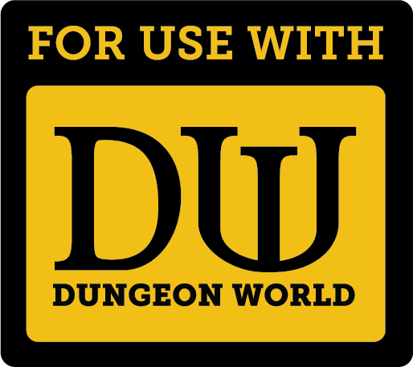
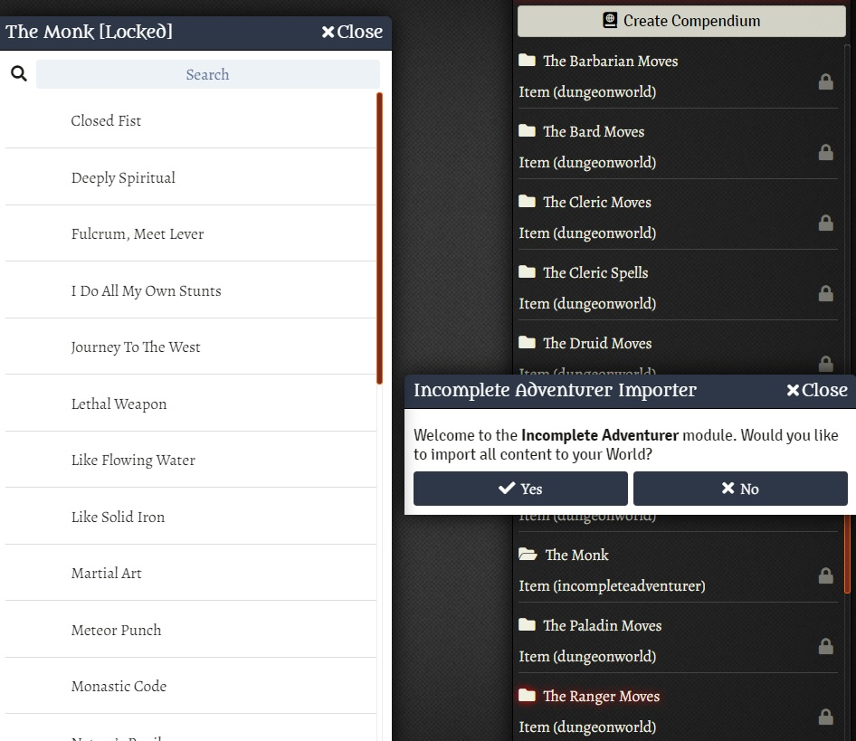

# Incomplete Adventurer for Dungeon World

  

Incomplete Adventurer are Additional Playbooks for Dungeon World Designed by Trevor Murray & Ben Rosenbloom.

The document has 18 playbooks and you can download the PDF at: https://benkrosenbloom.itch.io/incomplete-adventurer

# What is available?
## Playbooks
- The Alchemist
- The Berserker
- The Gunslinger
- The Merchant
- The Monk 
- The Runepriest
- The Sorcerer

# What's next?
All playbooks from the PDF.

# How to Install
1. Go to modules and use the link: 
https://raw.githubusercontent.com/brunocalado/incompleteadventurer/main/module.json

# How to Use

After an update you NEED to import again.

## Option 1
1. Go to Compendium
2. Choose the playbook you want.
3. Right click it and choose Import.
4. The class is available for the Character Builder now.

## Option 2
1. Click in any playbooks from the Compendium.
2. A dialog will ask you permission to import. 
3. Click yes to import everything to your world.

# Changelog
You can check changes at [CHANGELOG](CHANGELOG.md)

# License
Incomplete Adventurer are Additional Playbooks for Dungeon World Designed by Trevor Murray & Ben Rosenbloom.

The full text of Incomplete Adventurer is released under a Creative Commons Attribution license (CC-BY).

You can check it out at: https://benkrosenbloom.itch.io/incomplete-adventurer